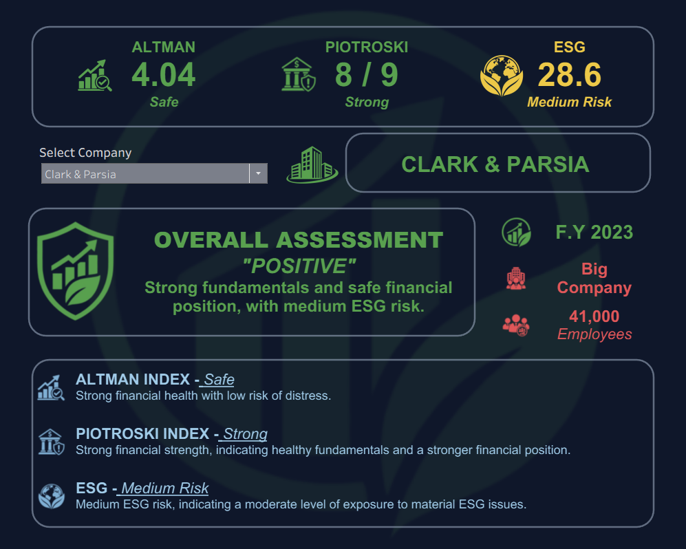
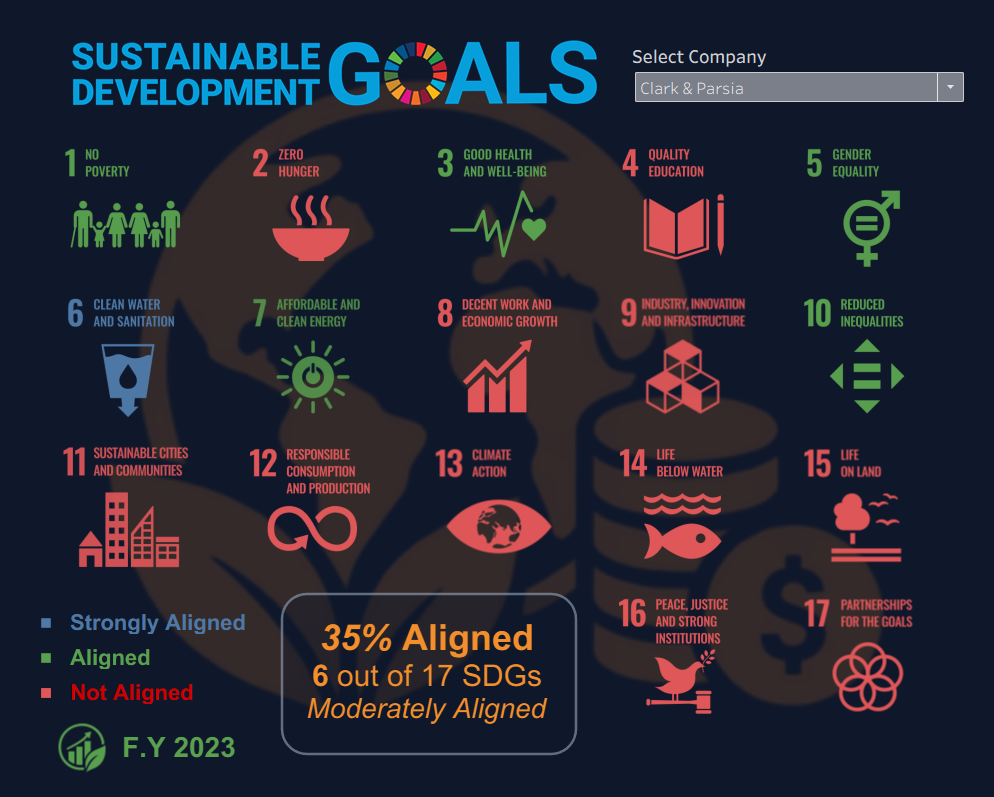
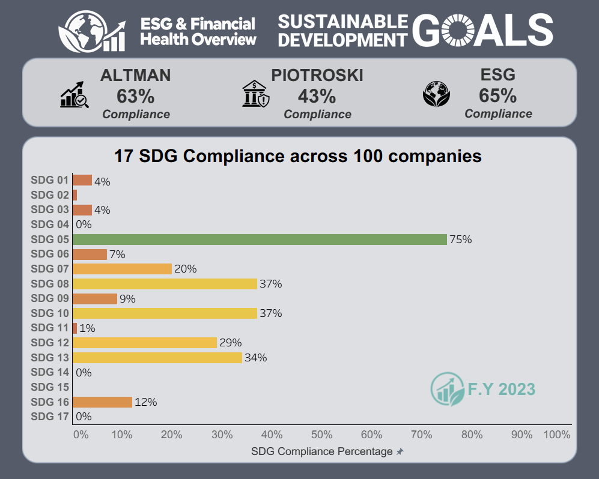

# Global Corporate ESG & Financial Analysis

An end-to-end **data analytics pipeline** analyzing ESG risk, financial health, and UN SDG alignment across a global corporate dataset.

**Stack:** Power Query / M · MySQL 8 · SQL · Tableau

*Disclaimer: This project is intended solely to showcase the author's skills and practical usage of Data Analytic tools. It is created for demonstration and portfolio purposes only and is not intended for academic or professional research. The visualizations and observations presented should not be interpreted as legitimate or conclusive findings.*

*This is also an unfinished project as of 09/09/2026.*

## Overview

This project takes raw corporate ESG data through:

**Ingestion → Data Cleaning → Database Staging → Type Conversion → SQL Extraction → Tableau Analysis**

The analysis focuses on:

- **ESG Risk** — supplied ESG scores and risk classification
- **Financial Health** — Piotroski F-Score and Altman Z-Score
- **Sustainability** — alignment across all 17 UN SDGs

## Repository Structure

The repository mirrors the local project architecture:

```text
Global-Corporate-ESG-Financial-Analysis/
│
├── README.md
├── metadata.json
├── esg_raw.csv
├── esg_clean.csv
│
├── analysis_01/
│   ├── 1_Descriptive_Analysis.twbx
│   ├── esg_analysis_01.csv
│   │
│   ├── assets/
│   │   ├── 1_Descriptive_Analysis_Raw.twb
│   │   └── E_SDG_logo_horizontal_PRINT_Transparent.png
│   │
│   └── samples/
│       ├── Fin_Select_Sample.gif
│       └── SDG_Selector_Sample.gif
│
├── power-query/
│   ├── power_query_M_code.pq
│   ├── power_query_M_code_summary.txt
│   └── esg_query_ref.xlsx
│
└── sql-scripts/
    ├── 01_Import.sql
    └── 02.1_Export_Analysis_01.sql
```

## Technical Workflow

```text
Raw CSV (51,181 × 85)
        │
        ▼
Power Query / M
  • Import & standardize
  • Clean text / nulls / percentages
  • Remove blank / duplicate records
  • Rename fields
        │
        ▼
Cleaned CSV
        │
        ▼
MySQL 8
  • TEXT staging layer
  • Typed production table
  • Indexing
  • Data-quality checks
        │
        ▼
SQL Analytical Extract
  • Complete ESG + financial + SDG records
        │
        ▼
Tableau
  ├── Financial Metrics
  └── 17 SDGs
```

## Dataset

**Source:** Global Corporate ESG and Financial Dataset  
**Dataset ID:** `tonylm00/business-companies-dataset`  
**Source Author's Note:** The data may be incorrect, being scraped from YahooFinance.com, Investing.com, StockAnalysis.com, MSCI  
**Coverage:** 50,000+ global companies  
**License:** CC0-1.0  
**Supplied raw file:** **51,181 records × 85 columns**

Key fields include company information, employees, ESG score, Piotroski score, Altman score, controversy indicators, decarbonization targets, temperature goals, and 17 SDG alignment indicators.

## Assets
### Tableau Dashboard - 01_Descriptive_Analysis
*“The content of this publication has not been approved by the United Nations and does not reflect the views of the United Nations or its officials or Member States”.*

- The logo assets used in the 01_Financial Metrics are AI-generated.
- The logo assets and the dashboard banner used in the 02_17_SDGs are derived from  https://www.un.org/sustainabledevelopment/news/communications-material/. 
- I do not own these but are publicly available as per UN guideline.
Here is the link to UN's website: https://www.un.org/sustainabledevelopment

## Data Preparation — Power Query

The M workflow imports the semicolon-delimited CSV using Windows-1252 encoding and standardizes the source before database loading.

Key transformations:

- Promote headers
- Treat imported fields as text before normalization
- Remove line breaks and `%` symbols
- Replace literal `null` values
- Trim whitespace
- Remove blank rows and duplicate records
- Clean decarbonization fields
- Rename nested source fields into analytical names

Example mappings:

```text
name                        → company_name
esg                         → esg_score
Controversies.Environment   → controversy_environment
Decarbonization Target.Year → decarb_target_year
sdg.Climate Action          → sdg_climate_action
```

The complete M transformation is preserved in `power_query_M_code.pq`.

> **Reproducibility:** update the machine-specific `File.Contents(...)` path before running the query on another machine.

## Database Engineering — MySQL

The cleaned data is loaded through a two-layer schema.

### Staging — `stg_esg`

Incoming fields are stored primarily as `TEXT` to preserve source values before conversion.

### Production — `esg_company`

Key analytical fields are converted to numeric types, empty values become `NULL`, and indexes are added to `company_name`, `ticker`, and `domain`.

`01_Import.sql` contains schema creation, CSV loading, type conversion, production-table insertion, and row-count/malformed-value checks.

## Analytical Extraction — SQL

`02.1_Export_Analysis_01.sql` filters for complete records containing:

- ESG score
- Employee count
- Piotroski score
- Altman score
- All 17 SDG indicators

**Output:** `esg_analysis_01.csv`  
**Result:** **100 companies × 23 fields**

The complete-case design improves comparability across metrics, but the 100-company extract is **not representative of the full 51,181-record source dataset**.

## Descriptive Analysis - Tableau Analysis

`1_Descriptive_Analysis.twbx` contains two dashboards. See samples below.

### Financial Metrics


### SDG Analysis


### Interactive Selector


### Compliance Summary


Combines:

- Piotroski F-Score
- Altman Z-Score
- ESG score
- Company size
- Combined financial/ESG interpretation

### 17 SDGs

Provides:

- SDG 1–17 analysis
- Interactive SDG selection
- Alignment percentage
- Alignment category

### Classification Framework

| Metric | Classification |
|---|---|
| **Piotroski** | ≤3 Weak · 4–6 Moderate · ≥7 Strong |
| **Altman** | >2.99 Safe · 1.81–2.99 Grey Zone · <1.81 Distress |
| **ESG** | <10 Negligible · 10–19.99 Low · 20–29.99 Medium · 30–39.99 High · ≥40 Severe |
| **SDG Alignment** | ≤30% Low · 31–60% Moderate · >60% High |

For SDGs, `Aligned` and `Strongly Aligned` are counted as aligned.

## Key Findings

Based on the **100-company complete-case extract**:

| Metric | Mean | Median | Range |
|---|---:|---:|---:|
| ESG Score | 19.01 | 18.10 | 8.40–41.30 |
| Piotroski Score | 6.04 | 6.00 | 2–9 |
| Altman Score | 6.37 | 4.04 | -4.88–58.64 |

### SDG Alignment

| SDG | Aligned |
|---|---:|
| SDG 5 — Gender Equality | **75%** |
| SDG 8 — Decent Work | **37%** |
| SDG 10 — Reduced Inequalities | **37%** |
| SDG 13 — Climate Action | **34%** |
| SDG 12 — Responsible Consumption | **29%** |
| SDG 7 — Clean Energy | **20%** |

**Average company:** 2.7 of 17 SDGs aligned (**15.9% overall alignment**).

SDGs **4, 14, 15, and 17** recorded 0% alignment in the extract.

### Folder / File Purpose

| Path | Purpose |
|---|---|
| `esg_raw.csv` | Original source dataset |
| `esg_clean.csv` | Power Query-standardized dataset |
| `analysis_01/` | Tableau analysis and analytical extract |
| `analysis_01/1_Descriptive_Analysis.twbx` | Packaged Tableau workbook |
| `analysis_01/esg_analysis_01.csv` | 100-record complete-case analytical dataset |
| `analysis_01/assets/` | Tableau workbook assets and supporting image |
| `analysis_01/samples/` | Dashboard interaction samples |
| `power-query/` | Power Query workflow and reference files |
| `power-query/power_query_M_code.pq` | Reproducible Power Query M script |
| `power-query/power_query_M_code_summary.txt` | Human-readable transformation summary |
| `power-query/esg_query_ref.xlsx` | Power Query reference workbook |
| `sql-scripts/` | Database and analytical SQL scripts |
| `sql-scripts/01_Import.sql` | MySQL schema, loading, conversion, and validation |
| `sql-scripts/02.1_Export_Analysis_01.sql` | Complete-case analytical extraction |
| `metadata.json` | Dataset metadata |

## Reproduction

1. Update the source path in `power_query_M_code.pq`.
2. Run the Power Query transformation and export `esg_clean.csv`.
3. Update the `LOAD DATA LOCAL INFILE` path in `01_Import.sql`.
4. Run `01_Import.sql` to create and populate the MySQL schema.
5. Run `02.1_Export_Analysis_01.sql` and export `esg_analysis_01.csv`.
6. Open `1_Descriptive_Analysis.twbx` and reconnect the CSV if required.

## Data Quality & Limitations

- The supplied raw and cleaned files both contain **51,181 × 85**; the observable change is primarily standardization and field renaming.
- The final analysis uses **100 complete records** rather than the full source population.
- Complete-case filtering may introduce **selection bias**.
- ESG, Piotroski, and Altman values are **source-supplied**, not independently recalculated.
- `Aligned` and `Strongly Aligned` are treated equally in the SDG percentage.
- Results are **descriptive** and are not intended as causal, predictive, or investment conclusions.

## Skills Demonstrated

**Data Preparation:** Power Query / M, ETL, text normalization, null handling, field standardization

**Database & SQL:** MySQL schema design, staging/production layers, data types, indexing, validation, analytical extraction

**Analytics:** ESG analysis, financial-health metrics, complete-case analysis, SDG analysis, classification logic

**Visualization:** Tableau calculated fields, parameters, interactive dashboards, business-facing interpretation

**Reproducibility:** documented M workflow, SQL scripts, analytical extract, and packaged Tableau workbook

## Author
Chestersin Carandang/ches-07
